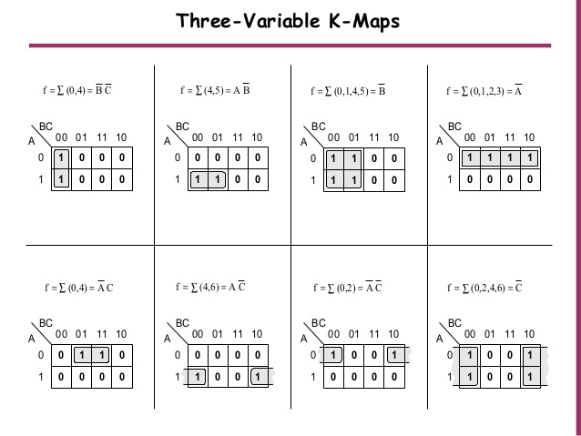

## 1-What is Karnaugh Map and what is it used for ? 
 The Karnaugh map (KM or K-map) is a method of simplifying Boolean algebra expressions, and reduces the need for extensive calculations by taking advantage of humans' pattern-recognition capability. It also permits the rapid identification and elimination of potential race conditions.
## 2- How to solve it ?
-Select K-map according to the number of variables. 
-Identify minterms or maxterms as given in problem. 
-For SOP(Sum Of Products) put 1’s in blocks of K-map respective to the minterms (0’s elsewhere). 
-For POS(Product Of Sum) put 0’s in blocks of K-map respective to the maxterms(1’s elsewhere). 
-Make rectangular groups containing total terms in power of two like 2,4,8 ..(except 1) and try to cover as many elements as you can in one group. 
-From the groups made in step 5 find the product terms and sum them up for SOP form. 
## 3-Example:
 
